# 🎓 College Project — System Architecture

> A collection of 5 web-based college management systems built with **HTML, CSS, and vanilla JavaScript**, using **LocalStorage** as the persistence layer. Each project follows a multi-page architecture with role-based access control.

---

## 📑 Table of Contents

| # | Project | Description |
|---|---------|-------------|
| 1 | [Equipment Booking System](#1--equipment-booking-system) | Book and manage college equipment |
| 2 | [Fest Registration Portal](#2--fest-registration-portal) | Register for college fest events |
| 3 | [Lost & Found Portal](#3--lost--found-portal) | Report and track lost/found items |
| 4 | [Learning Portal (LMS)](#4--learning-portal-lms) | Course enrollment and video-based learning |
| 5 | [Smart Token System](#5--smart-token-system) | College canteen ordering with wallet & tokens |

---

## 1. 📦 Equipment Booking System

**EquipBook** — A system for students to browse and book college equipment (cameras, laptops, projectors, etc.) and for admins to manage inventory.

### Tech Stack

| Layer | Technology |
|-------|-----------|
| Frontend | HTML5, CSS3 (Glassmorphism), JavaScript ES6+ |
| Storage | LocalStorage (JSON) |
| Fonts/Icons | Google Fonts (Outfit), Font Awesome 6 |
| Auth | SessionStorage-based role sessions |

### File Structure

```
equipment-booking-system/
├── index.html              # Login page (Student / Admin)
├── student_dashboard.html   # Student: browse & book equipment
├── admin_dashboard.html     # Admin: manage inventory & bookings
├── script.js               # All classes & controllers
└── style.css               # Glassmorphism theme
```

### System Architecture

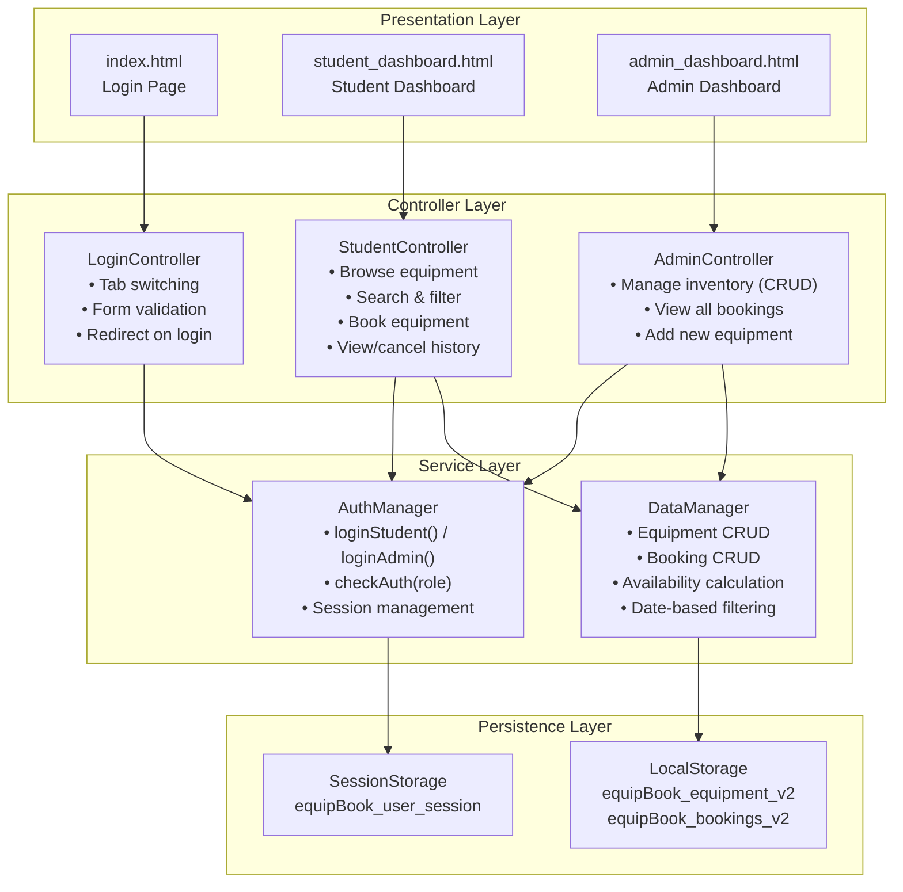

### Data Flow

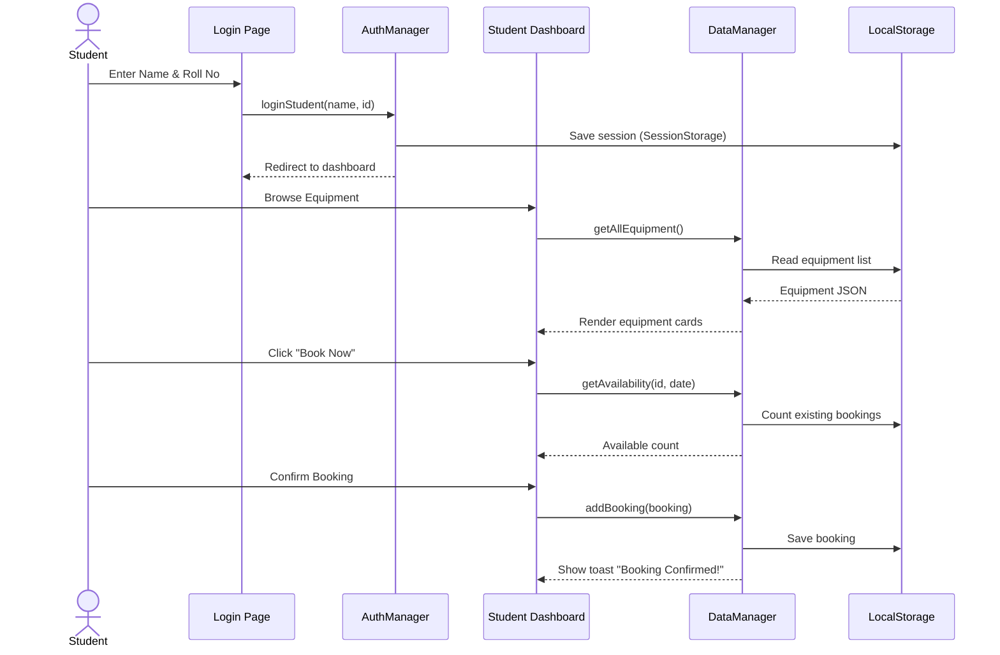

---

## 2. 🎪 Fest Registration Portal

**College Fest 2026** — An event registration system for college fests. Students can browse events and register; admins can create, edit, and manage events.

### Tech Stack

| Layer | Technology |
|-------|-----------|
| Frontend | HTML5, CSS3 (Glassmorphism), JavaScript ES6+ |
| Storage | LocalStorage (JSON) |
| Fonts/Icons | Google Fonts (Outfit), Font Awesome 6 |
| Auth | SessionStorage-based role sessions |

### File Structure

```
fest-registration-portal/
├── index.html              # Login page (Student / Admin)
├── student-portal.html     # Student: browse events & register
├── admin-dashboard.html    # Admin: manage events & registrations
├── script.js               # All classes & controllers
└── style.css               # Glassmorphism theme
```

### System Architecture

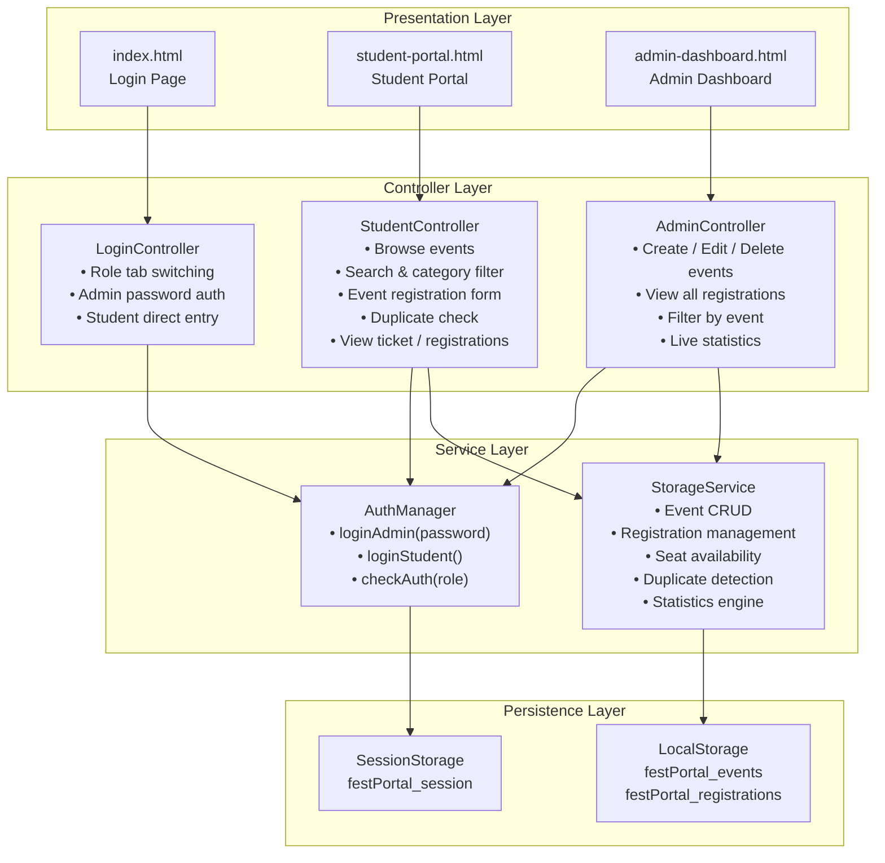

### Data Flow

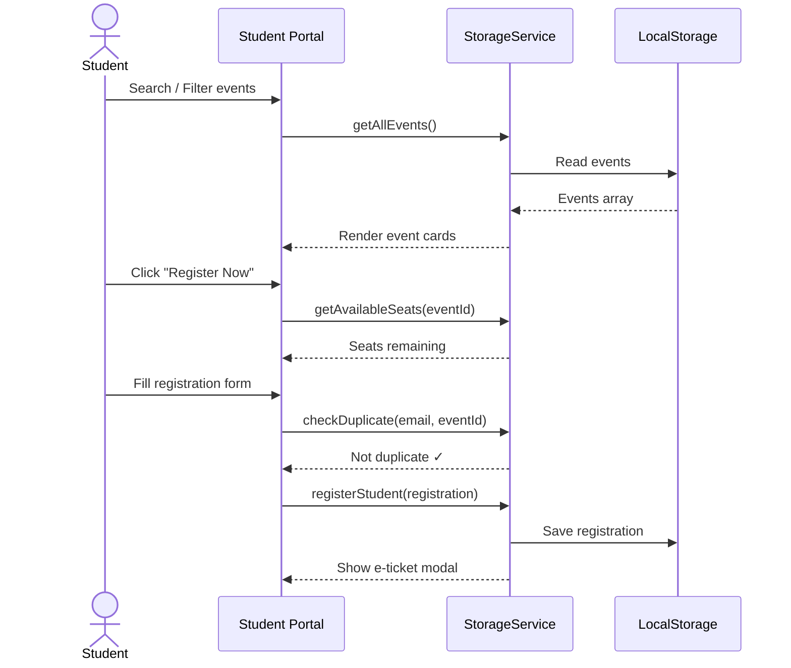

---

## 3. 🔍 Lost & Found Portal

**Nexus Retrieve** — A portal for students to report lost or found items, view item details, and manage secure handovers with identity verification.

### Tech Stack

| Layer | Technology |
|-------|-----------|
| Frontend | HTML5, CSS3 (Neon/Dark theme), JavaScript ES6+ |
| Storage | LocalStorage (JSON) |
| Architecture | Monolithic SPA-like with URL routing |
| Image Upload | Base64 FileReader API |

### File Structure

```
last-and-found-portal/
├── index.html              # Home feed — all lost/found items
├── report-item.html        # Report a lost or found item
├── item-details.html       # Item details + handover action
├── dashboard.html          # User's reported items
├── css/
│   └── style.css           # Neon-dark glassmorphism theme
└── js/
    └── script.js           # NexusCore engine (monolithic)
```

### System Architecture

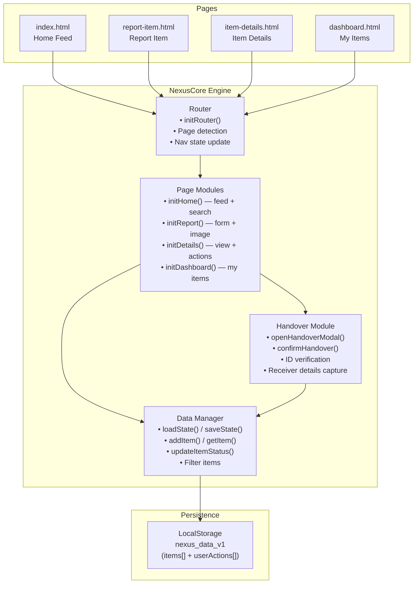

### Item Lifecycle

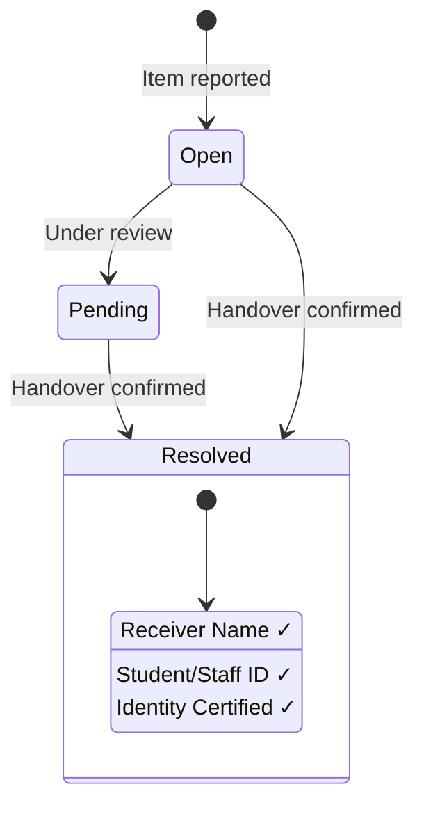

---

## 4. 📚 Learning Portal (LMS)

**Learning Management System** — A full-featured LMS for staff to manage courses and for students to enroll, watch video lessons, and track progress.

### Tech Stack

| Layer | Technology |
|-------|-----------|
| Frontend | HTML5, CSS3 (Light/Dark theme), JavaScript ES6+ |
| Storage | LocalStorage (JSON) |
| Architecture | Modular (separate JS modules per concern) |
| Video Player | Embedded YouTube (iframe) |
| Auth | Email-based with role (staff/student) |

### File Structure

```
learning-portal/
├── index.html               # Login page
├── student-dashboard.html   # Student: enrolled courses + progress
├── staff-dashboard.html     # Staff: manage courses & enrollments
├── learning-player.html     # Video player + lesson navigation
├── assets/                  # Static assets
├── css/
│   ├── theme.css            # Design tokens & variables
│   └── components.css       # Reusable component styles
└── js/
    ├── storage.js           # LocalStorage abstraction (Storage)
    ├── auth.js              # Authentication module (Auth)
    ├── courses.js           # Course CRUD module (Courses)
    ├── enrollments.js       # Enrollment & progress module (Enrollments)
    └── ui.js                # Toast, Modal, Theme, Loader (UI)
```

### System Architecture

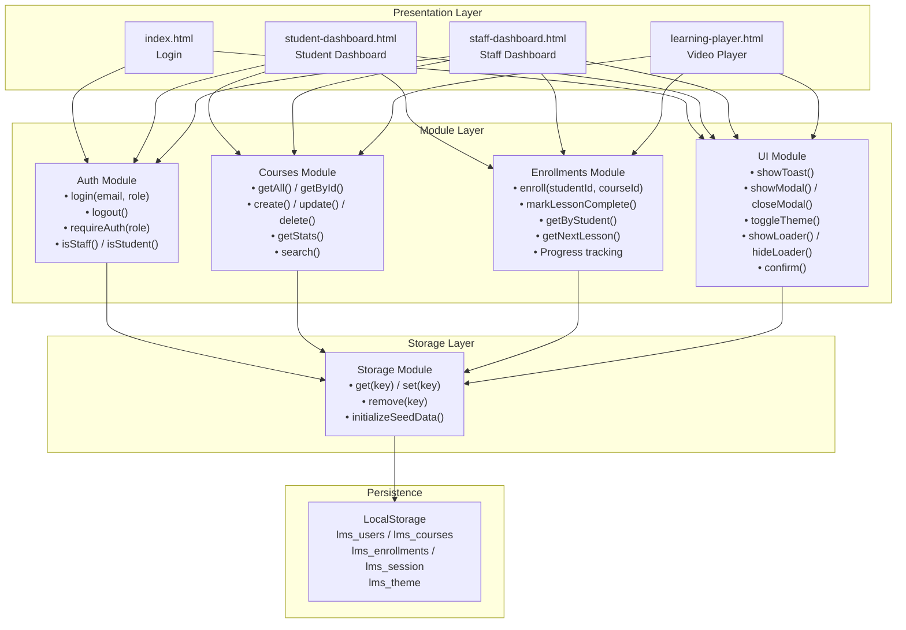

### Student Learning Flow

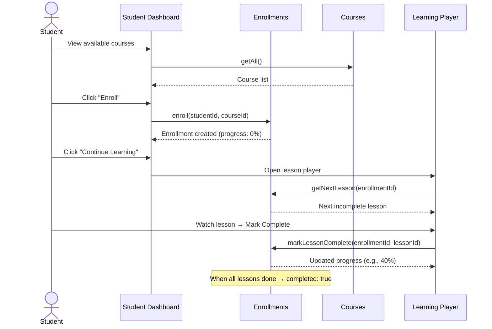

---

## 5. 🍽️ Smart Token System

**Nexus-Crave** — A canteen ordering system with a digital wallet, menu browsing, cart checkout, token-based order tracking, and an admin panel for managing menu items and order statuses.

### Tech Stack

| Layer | Technology |
|-------|-----------|
| Frontend | HTML5, CSS3, JavaScript (ES Modules) |
| Storage | LocalStorage (JSON) |
| Architecture | Multi-page with shared ES Module state |
| Currency | ₹ (INR) |
| Auth | Token-based login (localStorage) |

### File Structure

```
smart-token-system/
├── index.html              # Menu browsing + add to cart
├── login.html              # Student login
├── checkout.html           # Cart review & wallet payment
├── my-orders.html          # Order tracking with token IDs
├── admin-login.html        # Admin login
├── canteen-admin.html      # Admin: manage menu & orders
├── SharedState.js          # Shared state manager (ES Module)
├── menu.js                 # Default menu items data
├── styles.css              # Global styles
└── theme.css               # Theme variables
```

### System Architecture

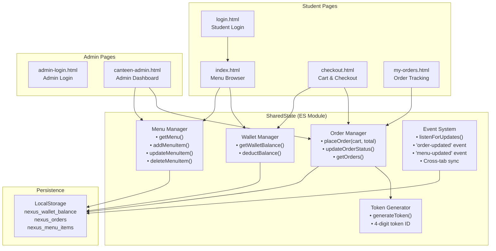

### Order Flow

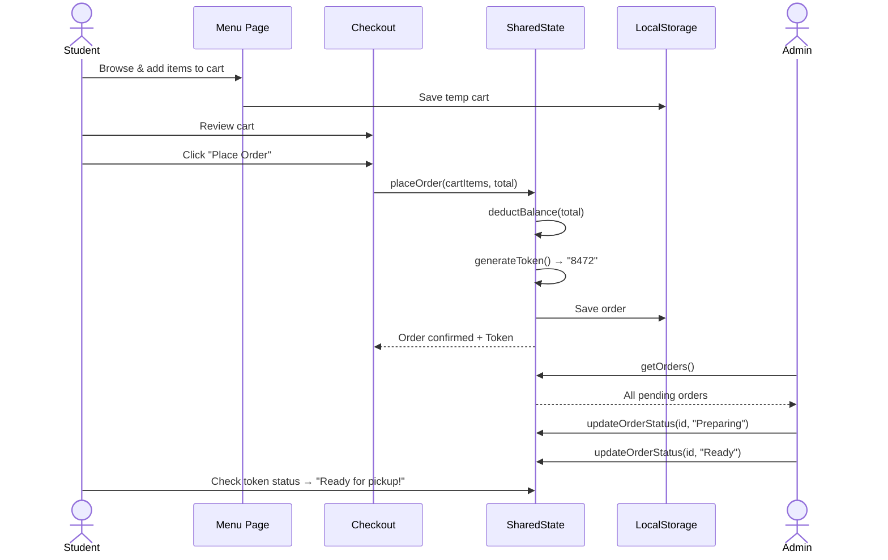

---

## 🏗️ Common Architecture Pattern

All 5 projects share a similar architectural philosophy:

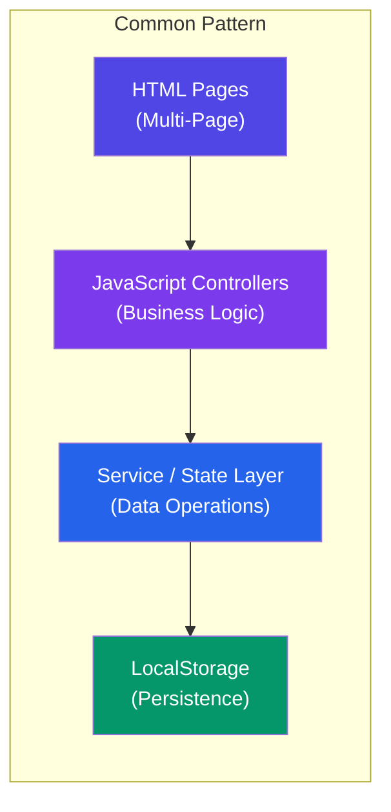

| Feature | Equipment Booking | Fest Portal | Lost & Found | Learning Portal | Smart Token |
|---------|:-:|:-:|:-:|:-:|:-:|
| Multi-page | ✅ | ✅ | ✅ | ✅ | ✅ |
| Role-based auth | ✅ | ✅ | ❌ | ✅ | ✅ |
| LocalStorage | ✅ | ✅ | ✅ | ✅ | ✅ |
| Glassmorphism UI | ✅ | ✅ | ✅ | ✅ | ❌ |
| ES Modules | ❌ | ❌ | ❌ | ❌ | ✅ |
| Seed Data | ✅ | ✅ | ✅ | ✅ | ✅ |
| Search/Filter | ✅ | ✅ | ✅ | ✅ | ✅ |
| Toast Notifications | ✅ | ✅ | ❌ | ✅ | ✅ |

---

## 🚀 How to Run

All projects are **purely frontend** — no server or build step needed:

1. Open any project folder
2. Launch `index.html` in a modern browser
3. Data persists in your browser's LocalStorage

---

> **Built with ❤️ for College Coursework**
